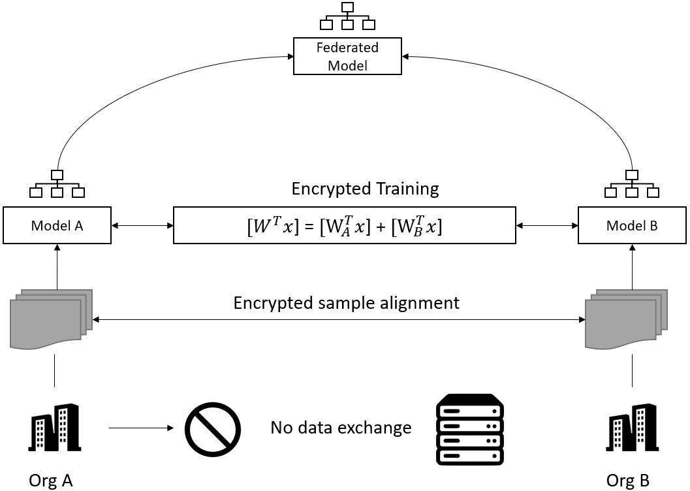

# fate-operator: Kubernetes Operator for FATE (Federated AI Technology Enabler)
## Overview

**fate-operator will be ready soon.**

All suggestions are welcome. If you willing to disucss fedearted machine learning or know anything about this project, raise issue or email me: playne@vmware.com

## Background

Federated machine learning (FML) is a machine learning setting where many clients (e.g. mobile devices or organizations) collaboratively train a model under the coordination of a central server while keeping the training data decentralized. Only the encrypted mediate parameters are exchanged between clients with MPC or homomorphic encryption.

FML has received significant interest recently, because of its effectiveness to solve data silos and data privacy preserving problems. Companies participated in federated machine learning include 4Paradigm, Ant Financial, Data Republic, Google, Huawei, Intel, JD.com, Microsoft, Nvidia, OpenMind, Pingan Technology, Sharemind, Tencent, VMware, Webank etc. 

Depending on the differences in features and sample data space, federated machine learning can be classified into _horizontal federated machine learning_, _vertical federated machine learning_ and _federated transfer learning_. Horizontal federated machine learning is also called sample-based federated machine learning, which means data sets share the same feature space but have different samples. With horizontal federated machine learning, we can gather the relatively small or partial datasets into a big one to increase the performance of trained models. Vertical federated machine learning is applicable to the cases where there are two datasets with different feature space but share same sample ID. With vertical federated machine learning we can train a model with attributes from different organizations for a full profile. Vertical federated machine learning is required to redesign most of machine learning algorithms. Federated transfer learning applies to scenarios where there are two datasets with different features space but also different samples. 

[FATE (Federated AI Technology Enabler)](https://fate.fedai.org) is an open source project initialized by Webank, [now hosted at the Linux Foundation](https://fate.fedai.org/2019/09/18/first-digital-only-bank-in-china-joins-linux-foundation/). FATE is the only open source FML framework that supports both horizontal and vertical FML currently. The architecture design of FATE is focused on providing FML platform for enterprises. [KubeFATE](https://github.com/FederatedAI/KubeFATE) is an open source project to deploy FATE on Kubernetes and is a proven effective solution for FML use cases. 

More technologies of Federated machine learning, please refer to [Reference section](#reference)

**The design proposal of fate-operator can be found in [kubeflow/community/fate-operator-proposal.md](https://github.com/kubeflow/community/blob/master/proposals/fate-operator-proposal.md).**

## Reference
1. Qiang Yang, Yang Liu, Tianjian Chen, and Yongxin Tong. Federated machine learning: Concept and applications. CoRR, abs/1902.04885, 2019. URL http://arxiv.org/abs/1902.04885
2. Peter Kairouz et al. Advances and open problems in federated learning. arXiv preprint arXiv:1912.04977